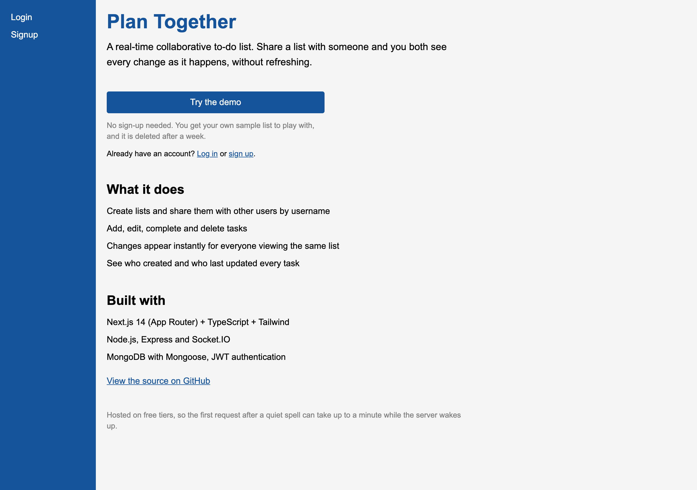
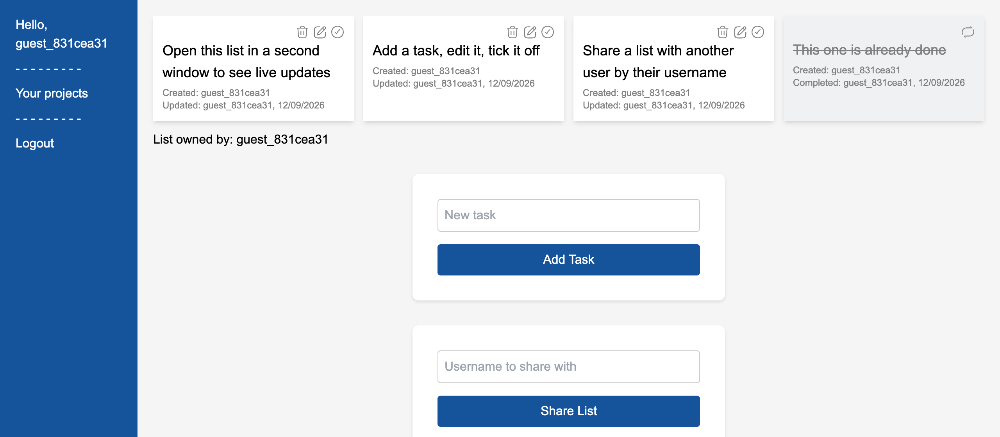

# Plan Together

A real-time collaborative to-do list. Share a list with someone and you both see
every change as it happens, without refreshing.

**[Live demo](https://collab-plan.vercel.app)** — no sign-up needed, click "Try
the demo" for a throwaway account with a sample list. It runs on free hosting, so
the first request after a quiet spell takes up to a minute while the server wakes.



Open a list in two windows and watch tasks appear, change and get ticked off in
both at once — that is Socket.IO pushing events to every client in the list's room.



## Repo layout

| Workspace | Path | Stack |
| --- | --- | --- |
| Backend | [`apps/backend`](apps/backend) | Express, Socket.IO, Mongoose (MongoDB), JWT |
| Frontend | [`apps/frontend`](apps/frontend) | Next.js 14 (App Router), TypeScript, Tailwind |

Managed with npm workspaces: one `npm install` at the root installs both apps and
writes a single `package-lock.json`.

## Hosting

| Piece | Where |
| --- | --- |
| Frontend | Vercel, root directory `apps/frontend` |
| Backend | Render, configured by [`render.yaml`](render.yaml) |
| Database | MongoDB Atlas |

The backend needs a long-lived process for Socket.IO, which is why it is not on
Vercel alongside the frontend.

## Setup

```bash
npm install
cp apps/backend/.env.example apps/backend/.env
cp apps/frontend/.env.example apps/frontend/.env.local
```

Then fill in `apps/backend/.env` (`DB_HOST` connection string and `JWT_SECRET`).

## Development

```bash
npm run dev            # backend (:3001) and frontend (:3000) together
npm run dev:backend    # backend only
npm run dev:frontend   # frontend only
```

## Production

```bash
npm run build          # next build
npm start              # backend + next start
```

## Other

```bash
npm run lint           # next lint
```

## Environment variables

`apps/backend/.env`

| Variable | Purpose |
| --- | --- |
| `DB_HOST` | MongoDB connection string |
| `PORT` | Port the API/Socket.IO server listens on (default 3001) |
| `JWT_SECRET` | Secret used to sign auth tokens |
| `FRONTEND_URL` | Allowed CORS origin (the frontend's URL) |

`apps/frontend/.env.local`

| Variable | Purpose |
| --- | --- |
| `NEXT_PUBLIC_API_URL` | Base URL of the backend API, e.g. `http://localhost:3001/api` |
| `NEXT_PUBLIC_SOCKET_URL` | Base URL of the Socket.IO server, e.g. `http://localhost:3001` |

## History

This repo was formed from two repos, merged with their full history intact:

- backend — `viravelmozhna/collab-plan-node` → `apps/backend`
- frontend — `viravelmozhna/collab-plan-next` → `apps/frontend`
